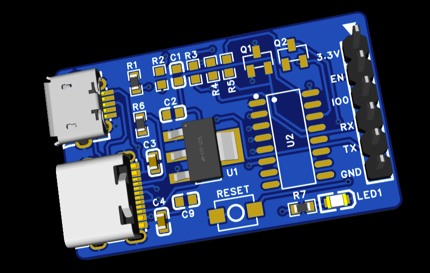
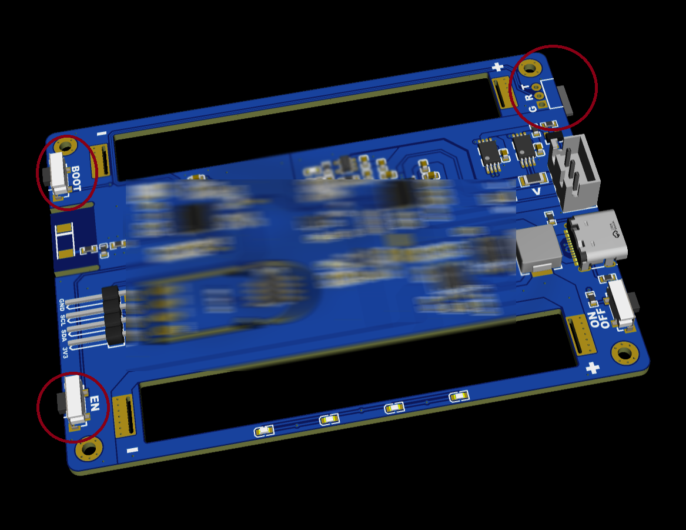

# ESP Auto Programmer

---

## 简介 | Introduction

**ESP Auto Programmer 是一个独立的 ESP 自动烧录器，用于 ESP32 / ESP12F 等 ESP 系列芯片的开发与量产烧录。**  
它将自动下载电路从目标板中剥离出来，使目标板在**无 USB、无 BOOT / RESET 按钮**的情况下，仍可实现方便、可靠的一键烧录。

**ESP Auto Programmer is a standalone automatic programmer for ESP32 / ESP12F and other ESP series chips.**  
It separates the auto-programming circuitry from the target board, allowing **button-less and USB-free target designs** while still supporting one-click flashing during development.

---

## 项目背景 | Background

### 方案一：手动烧录方式  
### Method 1: Manual Programming

- 引出 `BOOT` 和 `RESET` 信号
- 各自连接实体按钮
- 同时引出串口（UART）

烧录步骤：
1. 按住 BOOT
2. 按下 RESET
3. 松开按键，使 ESP 进入烧录模式
4. 开始烧录固件

**缺点：**
- 操作繁琐
- 开发效率低
- **产品必须保留 BOOT / RESET 按钮，占用空间**

---

### Method 1 Summary (English)

- BOOT and RESET pins are connected to physical buttons
- UART is exposed for flashing
- User must manually control boot sequence

**Drawbacks:**
- Tedious flashing process
- Low development efficiency
- **Extra buttons required on final product**

---

### 方案二：板载自动烧录电路  
### Method 2: On-board Auto Programming Circuit

- 使用 CH340 / CP2102 等 USB 转串口芯片
- 通过三极管或 MOS 管自动控制 `BOOT` / `RESET`
- 无需按键即可烧录

**问题：**
- 自动烧录电路仅在开发阶段有用
- 产品阶段属于冗余设计
- 增加 BOM 成本
- 占用 PCB 空间
- 产品仍需保留 USB 接口

---

### Method 2 Summary (English)

- USB-to-UART chip with auto boot circuitry
- No manual button interaction required

**Issues:**
- Unnecessary for final products
- Increased cost and PCB size
- USB interface still required

---

## 项目目标 | Project Goal

> **将自动烧录功能从目标板中彻底剥离，  
> 使产品硬件保持最小化，而开发体验不受影响。**

> **Fully separate the auto-programming function from the target board,  
> achieving minimal product hardware without sacrificing development convenience.**

---

## 设计思路 | Design Concept

<!-- ↑ 系统结构图 / 连接示意图 -->

### 目标板（Target Board）

- ❌ 不集成 USB 转串口芯片  
- ❌ 不设计自动下载电路  
- ❌ **不需要 BOOT / RESET 按钮**  
- ✅ 仅引出一个 **2.54mm 间距 6Pin 烧录接口**

### 烧录器（ESP Auto Programmer）

- 集成 USB 转串口
- 自动控制 BOOT / RESET
- 即插即用，一键烧录

---

## 6Pin 接口说明 | 6Pin Interface

|  Pin | Signal | Description       |
| ---: | ------ | ----------------- |
|    1 | 3.3V   | Power             |
|    2 | EN     | Reset Control     |
|    3 | IO0    | Boot Mode Control |
|    4 | RX     | UART RX           |
|    5 | TX     | UART TX           |
|    6 | GND    | Ground            |

---

## 项目优势 | Advantages

- ✅ **省略 BOOT / RESET 按钮**
- ✅ 目标板无需 USB 接口
- ✅ 自动进入烧录模式
- ✅ 降低 BOM 成本
- ✅ 节省 PCB 空间
- ✅ 一套烧录器适配多个 ESP 项目

---

## 适用场景 | Use Cases

- ESP32 / ESP8266（ESP12F）开发与调试  
- 小体积、低成本产品设计  
- 量产前固件烧录  
- 不希望在产品上暴露 USB 或按键的设备  

---

## License

MIT License 