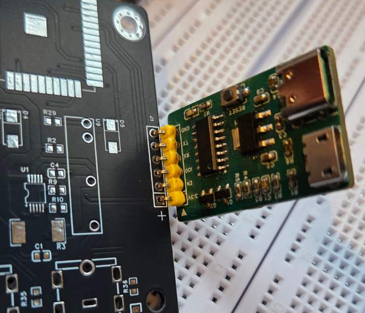

- 
  
- # Y_DEBUG  
  
  **ESP Auto Programmer / ESP32/ESP12F 自动烧录器**
  
  
  
  ---
  
  ## 简介 | Introduction
  
  **Y_DEBUG 是一个独立的 ESP 自动烧录与调试系统，  
  用于 ESP32 / ESP8266（ESP12F）等 ESP 系列芯片的开发与量产烧录。**
  
  **Y_DEBUG is a standalone ESP auto programming and debugging system  
  designed for ESP32 / ESP8266 (ESP12F) and other ESP series chips.**
  
  Y_DEBUG 将自动下载（Auto Programming）电路从目标板中彻底剥离，使目标板在  
  **无 USB 接口、无 BOOT / RESET 按钮**的情况下，  
  仍可实现**稳定、可靠的一键烧录体验**。
  
  Y_DEBUG fully separates the auto-programming circuitry from the target board,  
  allowing **USB-free and button-less target designs** while still providing  
  a **stable and reliable one-click flashing experience**.
  
  > 本项目中定义的标准 6Pin 调试 / 烧录接口，统一命名为 **Y_DEBUG 接口**。  
  > The standardized 6-pin debug/programming interface defined in this project  
  > is referred to as the **Y_DEBUG Interface**.
  
  ---
  
  ## 项目背景 | Background
  
  ### 方案一：手动烧录方式 | Method 1: Manual Programming
  
  
  
  - 引出 `BOOT` 和 `RESET` 信号  
    BOOT and RESET pins are exposed
  
  - 各自连接实体按钮  
    Each pin is connected to a physical button
  
  - 同时引出串口（UART）  
    UART interface is exposed for flashing
  
  **烧录步骤 | Programming Steps:**
  
  1. 按住 BOOT  
     Hold BOOT
  
  2. 按下 RESET  
     Press RESET
  
  3. 松开按键，使 ESP 进入烧录模式  
     Release buttons to enter flashing mode
  
  4. 开始烧录固件  
     Start flashing firmware
  
  **缺点 | Drawbacks:**
  
  - 操作繁琐  
    Tedious operation
  
  - 开发效率低  
    Low development efficiency
  
  - **产品必须保留 BOOT / RESET 按钮，占用 PCB 空间**  
    **BOOT / RESET buttons are required on final products, consuming PCB space**
  
  ---
  
  ### 方案二：板载自动烧录电路 | Method 2: On-board Auto Programming Circuit
  
  
  
  - 使用 CH340 / CP2102 等 USB 转串口芯片  
    USB-to-UART chips such as CH340 or CP2102 are used
  
  - 通过三极管或 MOS 管自动控制 `BOOT` / `RESET`  
    BOOT and RESET are automatically controlled via transistors or MOSFETs
  
  - 无需手动按键即可烧录  
    Programming without manual button interaction
  
  **问题 | Issues:**
  
  - 自动烧录电路仅在开发阶段有用  
    Auto-programming circuitry is only useful during development
  
  - 产品阶段属于冗余设计  
    Redundant in final products
  
  - 增加 BOM 成本  
    Increased BOM cost
  
  - 占用 PCB 空间  
    Consumes PCB area
  
  - 产品仍需保留 USB 接口  
    USB connector is still required
  
  ---
  
  ## 项目目标 | Project Goal
  
  > **Y_DEBUG 的目标是：  
  > 将自动烧录与调试功能从目标板中彻底剥离，  
  > 使产品硬件保持最小化，而开发体验不受影响。**
  
  > **The goal of Y_DEBUG is to fully separate auto-programming and debugging functions  
  > from the target board, enabling minimal hardware designs  
  > without sacrificing development convenience.**
  
  ---
  
  ## 设计思路 | Design Concept
  
  ### 目标板（Target Board）
  
  - ❌ 不集成 USB 转串口芯片  
    No USB-to-UART converter on the target board
  
  - ❌ 不设计自动下载电路  
    No on-board auto programming / download circuitry
  
  - ❌ **不需要 BOOT / RESET 按钮**  
    **No BOOT / RESET buttons required**
  
  - ✅ 仅引出一个 **Y_DEBUG 接口（2.54mm 间距 6Pin）**  
    Only a single **Y_DEBUG Interface (2.54mm pitch 6-pin)** is required
    
  - ✅ **仅引出一个 Y_DEBUG 接口（2.54 mm 间距 6 Pin）**
     Only a single **Y_DEBUG interface (2.54 mm pitch, 6-pin)** is required.
    
    🔧 **Y_DEBUG 针可直接插入焊盘，无需焊接插座即可完成烧录**
     The Y_DEBUG pins can be directly inserted into the PCB pads, allowing programming **without soldering a connector**.
    
    🚀 **特别适合一次性写入固件，后续通过 OTA 进行升级**
     This design is ideal for **one-time firmware flashing**, with all subsequent updates performed via **OTA (Over-the-Air)**.
    
  - 
  
  - 
  
  ---
  
  ### 烧录器（Y_DEBUG Programmer）
  
  - 集成 USB 转串口  
    Integrated USB-to-UART interface
  
  - 自动控制 BOOT / RESET  
    Automatic BOOT and RESET control
  
  - 即插即用，一键烧录  
    Plug-and-play, one-click programming
  
  ---
  
  ## Y_DEBUG 接口说明（6Pin）  
  ## Y_DEBUG Interface Description (6-Pin)
  
  Y_DEBUG 接口是 **Y_DEBUG Programmer 与目标板之间的标准调试 / 烧录接口**，  
  基于 ESP 官方 UART 下载机制设计，  
  适用于 ESP32 与 ESP8266（ESP12F）等芯片。
  
  The Y_DEBUG Interface is the standardized debug/programming interface  
  between the Y_DEBUG Programmer and the target board.  
  It is based on the official ESP UART download mechanism  
  and supports ESP32 and ESP8266 (ESP12F) devices.
  
  |  Pin | Signal | 描述 (CN)    | Description (EN)  |
  | ---: | ------ | ------------ | ----------------- |
  |    1 | 3.3V   | 电源（3.3V） | Power supply      |
  |    2 | EN     | 复位控制     | Reset control     |
  |    3 | IO0    | 启动模式控制 | Boot mode control |
  |    4 | RX     | 串口接收     | UART RX           |
  |    5 | TX     | 串口发送     | UART TX           |
  |    6 | GND    | 地           | Ground            |
  
  
  
  ---
  
  ## 项目优势 | Advantages
  
  - ✅ **无需 BOOT / RESET 按钮（由 Y_DEBUG 自动控制）**  
    **Eliminates BOOT / RESET buttons via Y_DEBUG**
  
  - ✅ 目标板无需 USB 接口  
    No USB connector required on target board
  
  - ✅ 自动进入烧录模式  
    Automatic programming mode entry
  
  - ✅ 降低 BOM 成本  
    Reduced BOM cost
  
  - ✅ 节省 PCB 空间  
    Smaller PCB footprint
  
  - ✅ 一套 **Y_DEBUG** 支持多个 ESP 项目  
    One **Y_DEBUG** supports multiple ESP-based projects
  
  ---
  
  ## 适用场景 | Use Cases
  
  - ESP32 / ESP8266（ESP12F）开发与调试  
    ESP32 / ESP8266 (ESP12F) development and debugging
  
  - 小体积、低成本产品设计  
    Compact and cost-sensitive product designs
  
  - 量产前固件烧录  
    Pre-production firmware programming
  
  - 不希望在产品上暴露 USB 或按键的设备  
    Devices where USB ports or buttons should not be exposed
